# ThailandGOGO 2023 泰國遊

## 行前準備

要帶好防曬的薄外套 
常備藥品 
隨身小包包 
耳塞 

## 第一天 11 / 09 (四) 
倚韓早上十點前到家 Uber 一起到高鐵 
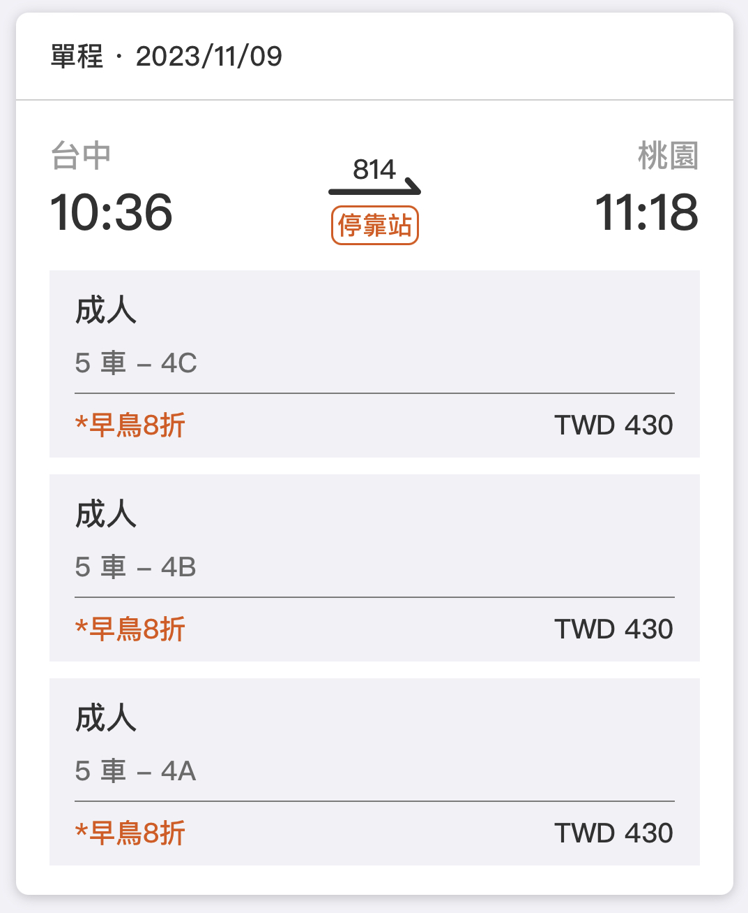 
預計第一天搭 10:36的高鐵 
 
11:32 轉機場捷運 預計 11:50 左右到機場 
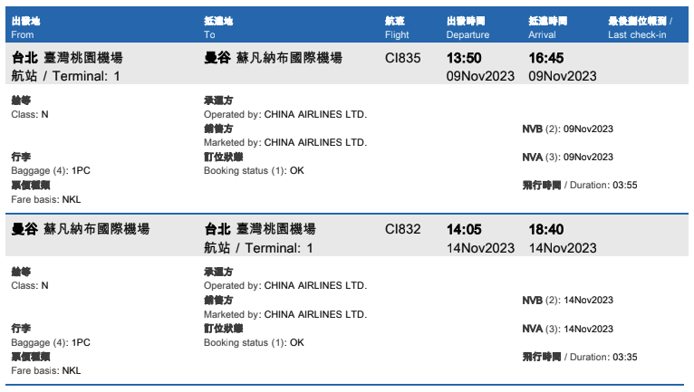 
12:00 機場會合倚萱至華航報到劃位托運行李等飛機 

16:45 到泰國後 等行李 入境 機場內取SIM卡 
4樓 - K線出發廳，開泰銀行展台旁 

預計當地時間五點半到六點才出機場  
搭專車移動到飯店 Check in  
預計 1830 左右可以自由活動  

有體力 -> 喬德夜市逛起來  
無體力 -> 飯店對面的 Terminal 21 走走吹冷氣  

## 第二天 11 / 10 (五) 

早上 0830 起床 

帶著台幣準備換錢 

早餐： Ai Ya Aroi 吃麵當早餐 
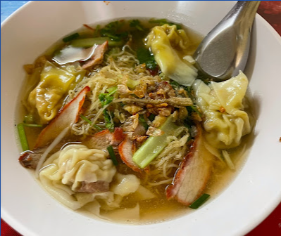 
不想吃麵的自己去旁邊7-11買熱壓吐司蛤～～  

大皇宮待到中午  
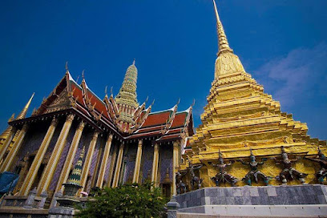 
午餐： 臥佛寺周邊餐廳選一個順眼的  
臥佛寺 大約一小時 搭船過去 鄭王廟  
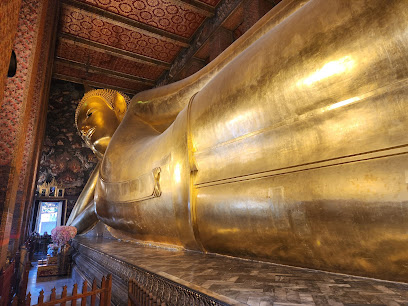 
鄭王廟 逛完 大約下午三～四點結束  
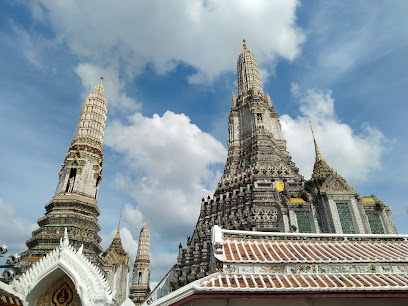 
有體力 -> ICON SIAM 暹羅天地 
無體力 -> 回飯店休息  

## 第三天 11 / 11 (六)

預計 0815 出門 自己抓時間起床  
早餐：必比登推薦麵店吃吃 
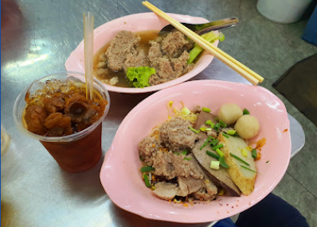 
到 Phrom Phong BTS 搭到 Siam 站下車 

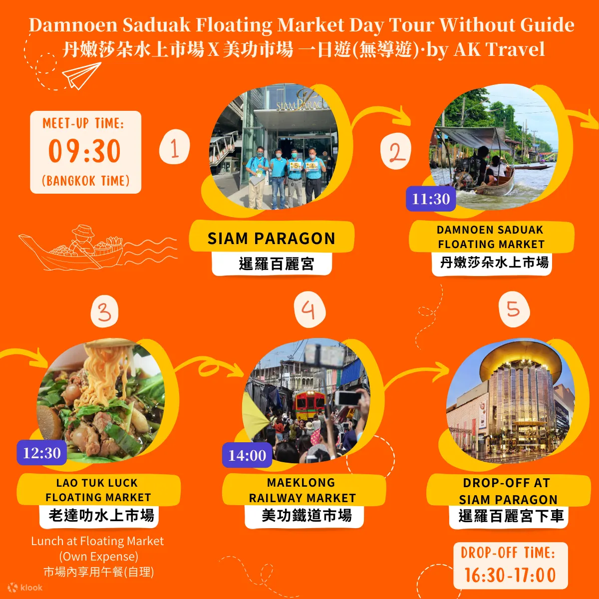

0930 暹羅百麗宮 集合上車 
1100~1130 到達 丹嫩莎朵水上市場  
1230 午餐：老達叻水上市場  
1400 美功鐵道市集  
1630 暹羅百麗宮 下車 

有體力 -> 水門市場  
無體力 -> 回飯店休息  
這天晚上要收行李 因為要換飯店 

## 第四天 11 / 12 (日)

0800 集合上車 
1000 Khao kheow 動物園 
1200 午餐 
1400 Wat kao chi chan 
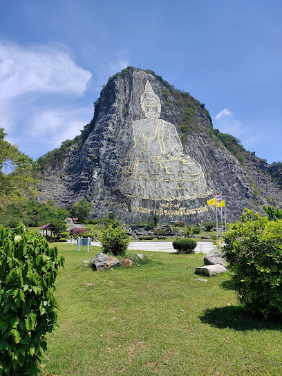 
1530 東芭樂園 
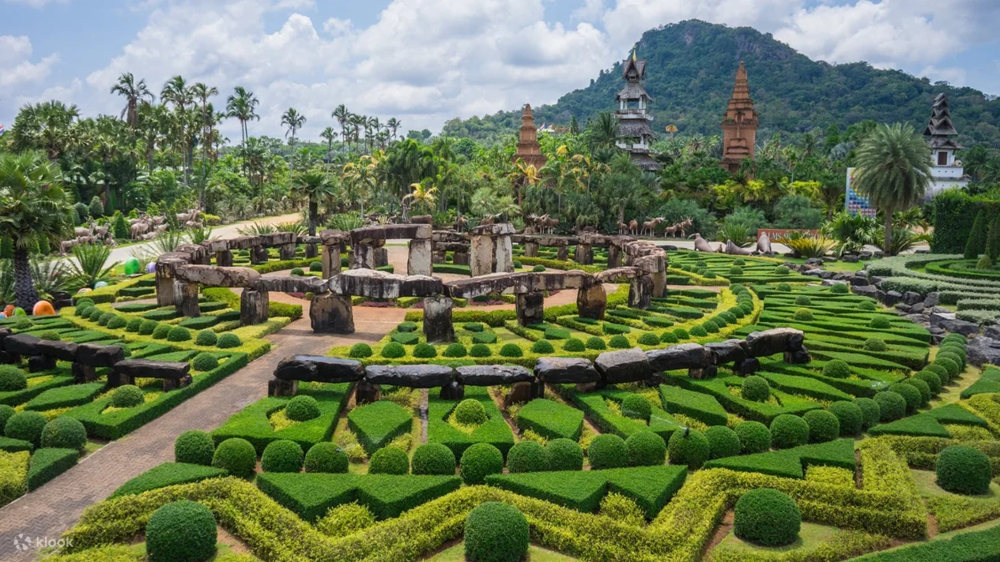
1730 喬木提恩海灘 
1830 Aster Hotel & Residence 
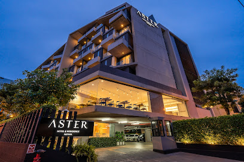

## 第五天 11 / 13 (ㄧ)

1200 集合 
Koh Larn 島 