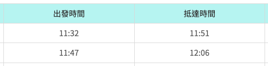

# ThailandGOGO 2023 泰國遊

## 行前準備

要帶好防曬的薄外套 
常備藥品 
隨身小包包 

## 第一天 11 / 09 (四) 
倚韓早上十點到家 Uber 一起到高鐵 

預計第一天搭 10:36的高鐵 

11:32 轉機場捷運 預計 11:50 左右到機場 

12:00 機場會合倚萱至華航報到劃位托運行李等飛機 

16:45 到泰國後 等行李 入境 機場內取SIM卡 

預計當地時間五點半到六點才出機場  
搭專車移動到飯店 Check in  
預計 1930 左右可以自由活動  

有體力 -> 喬德夜市逛起來  
無體力 -> 飯店對面的 Terminal 21 走走吹冷氣  

## 第二天 11 / 10 (五) 

早上 0830 起床  

早餐： 必比登推薦麵店吃吃  

大皇宮待到中午  

午餐： 臥佛寺周邊餐廳選一個順眼的  
臥佛寺 大約一小時 搭船過去 鄭王廟  
鄭王廟 逛完 大約下午三～四點結束  

有體力 -> ICON SIAM  
無體力 -> 回飯店休息  

## 第三天 11 / 11 (六)

早上 0830 起床  
早餐：  

0930 暹羅百麗宮 集合上車 
1100~1130 到達 丹嫩莎朵水上市場  
1230 午餐：老達叻水上市場  
1400 美功鐵道市集  
1630 暹羅百麗宮 下車 

## 第四天 11 / 12 (日)